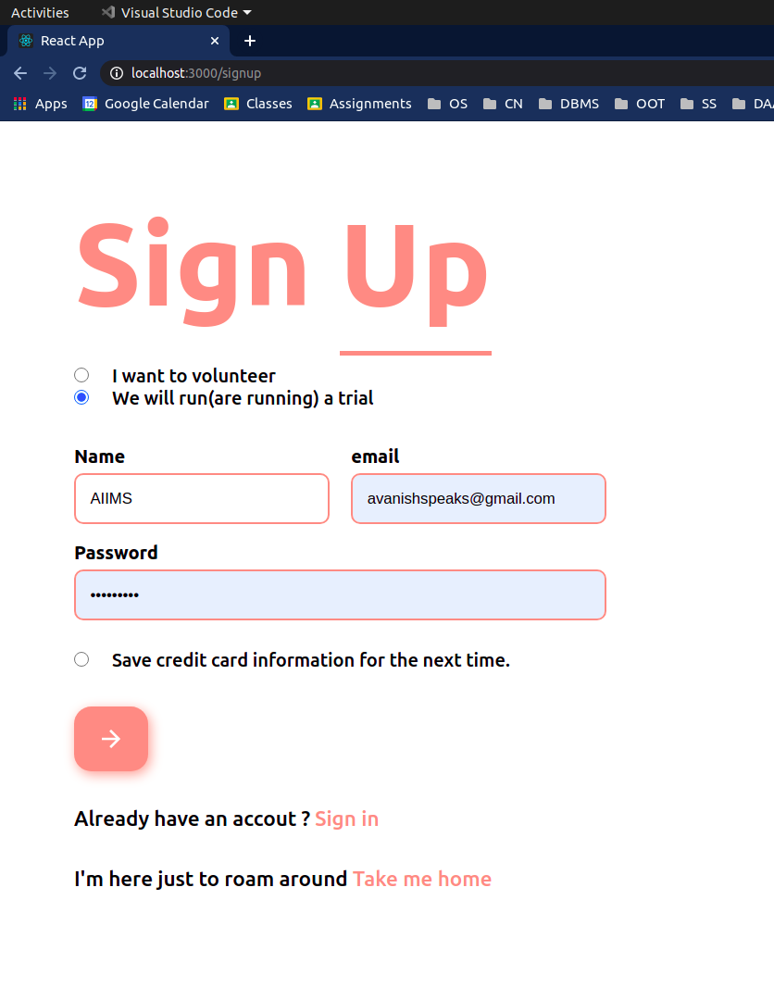
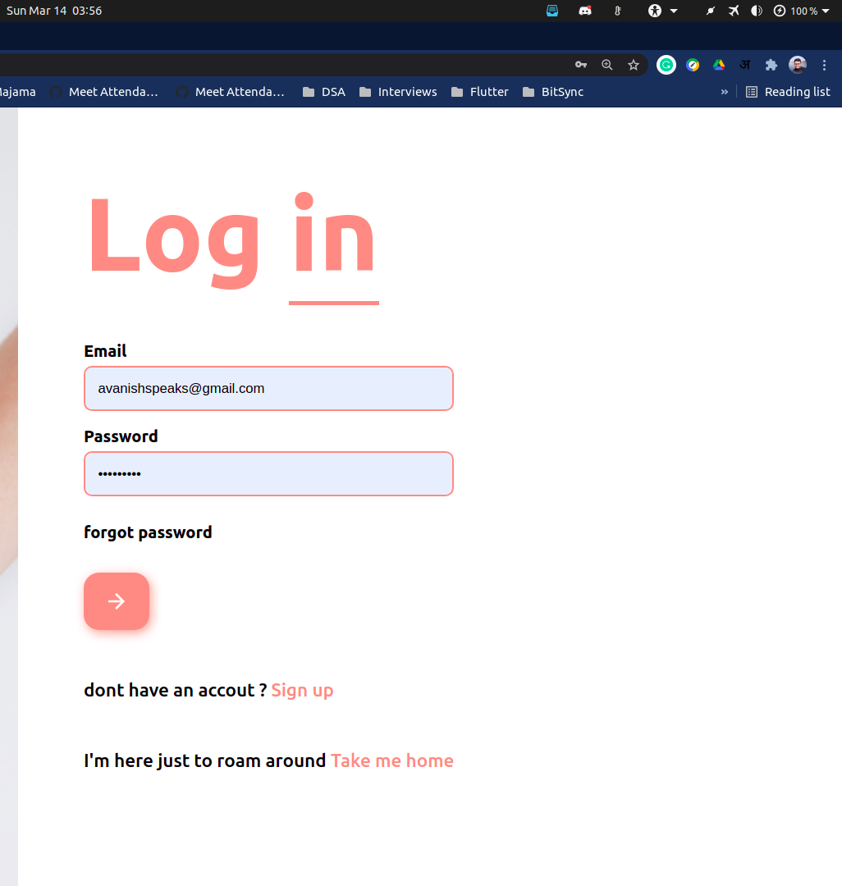
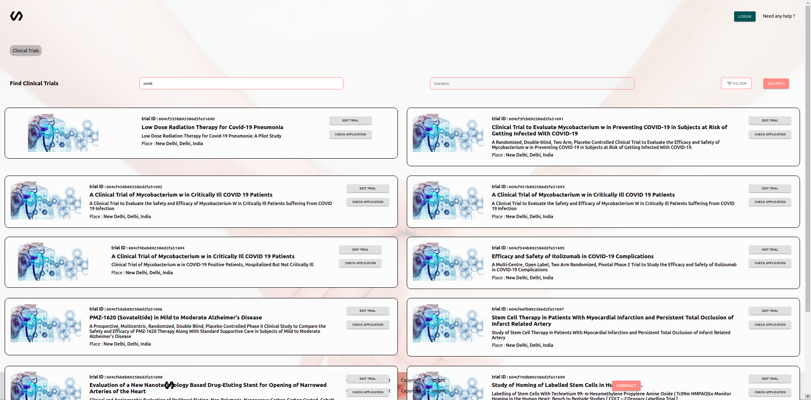
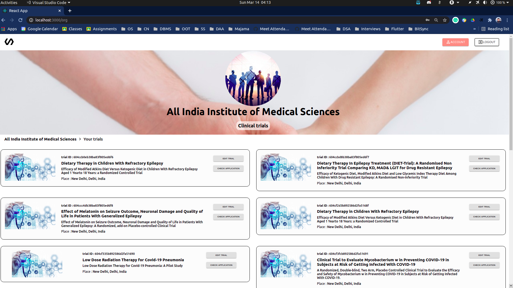

### vconnect
The repository for HackBash
- Production Branch: <b>main</b>

> ## VConnect: connects volunteers anonymously to the clinical trials.

>> Every year many people die because of the disease for which there is no cure available, and the reason is, we cannot infect new people to get a cure. We seek to help all of them by giving them a chance to help the medical studies by participating in clinical trials and contribute their bit for the better of humanity. This platform does not allow the information of the users to be exposed to the clinical trial organizations till before they actually needto contact them for physical confirmation.

### The users have the functionality to 
> - Check the current clinical trials going around based on <b>Age</b>, <b>Gender</b>, <b>City</b>, <b>State</b> or country.
> - submit primary application to the organization to participate in the trial without submitting the name, email, any social profile or address.
> - Accept or reject the invitation of an organization after primary screenign

## Features:
- Asks user at the time of sign up if they are volunteer or organization and automatically fetches it at the time of login
>  

- Based on a query, user can get a list of trials going on in a particular field .
> 

- Organizations get the list of their trials right at their dashboard, where they can add, edit or delete this trial, and select applicants first or second rounf of shortlisting
> 

## Starting the Application:
- Open the terminal(for linux) or command prompt(for Windows NT) and slide doen to the repo.
- open a new terminal and then, in first terminal, start the backend server using 
- `cd backend && npm install && start`
- The server will start at the port 8000
- Now, from the other terminal, start the web server by running command
- `cd frontend && npm install && npm start`
- The website will be opened on your local machine, but the database is synced with cloud clusters, hence any changes made locally will be applicable to  the production code too

> ### Contributions:
- [<b>Aditya Paul</b>](https://www.github.com/adityapaul18)        -> Front end major
- [<b>Avanish Gupta</b>](https://www.github.com/AvanishCodes)      -> Ideation
- [<b>Heli Vakharia</b>](https://www.github.com/heli576)      -> Back end major
- [<b>Nishant Singh</b>](https://www.github.com/iamoo7)      -> Frontend Design
